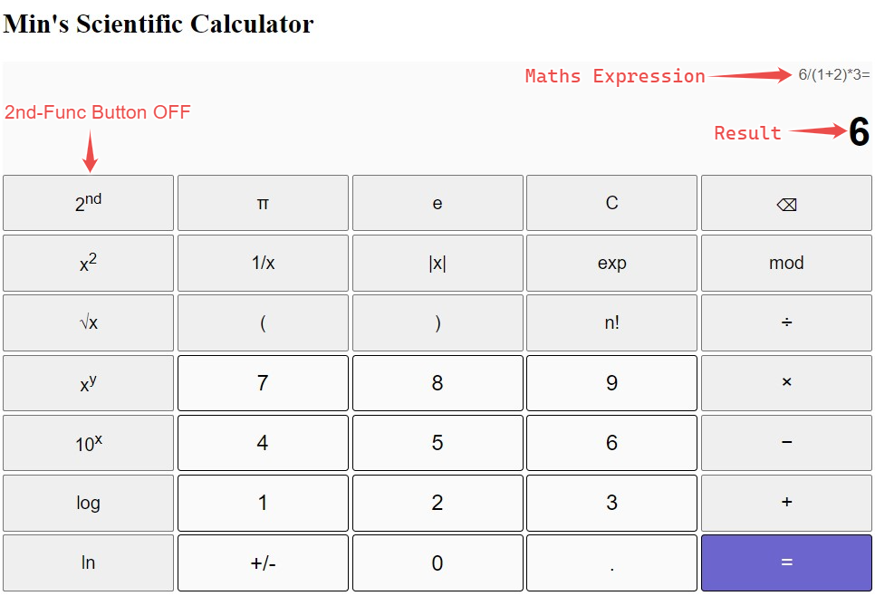
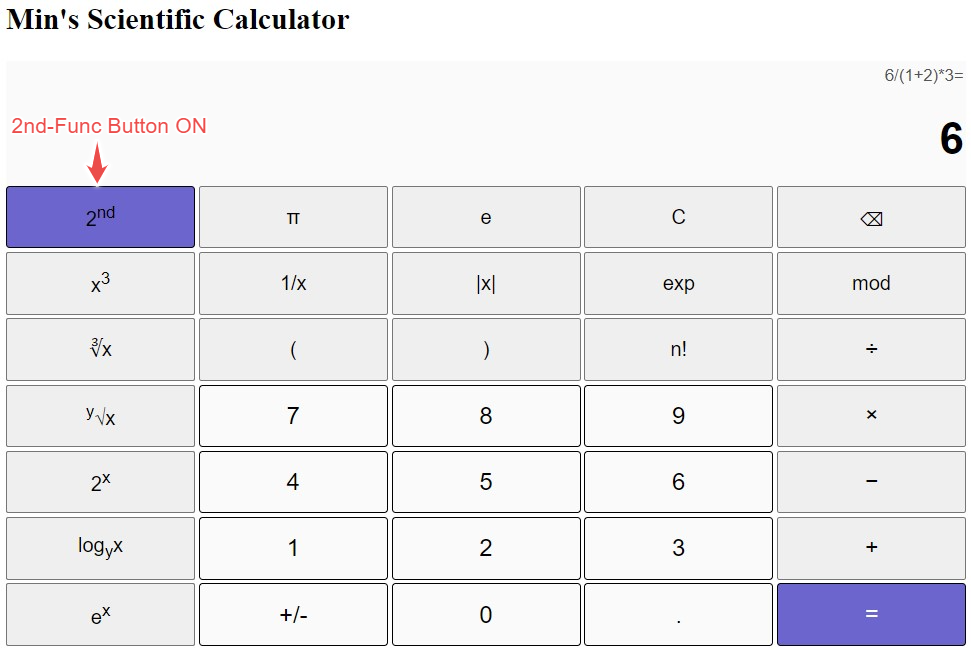
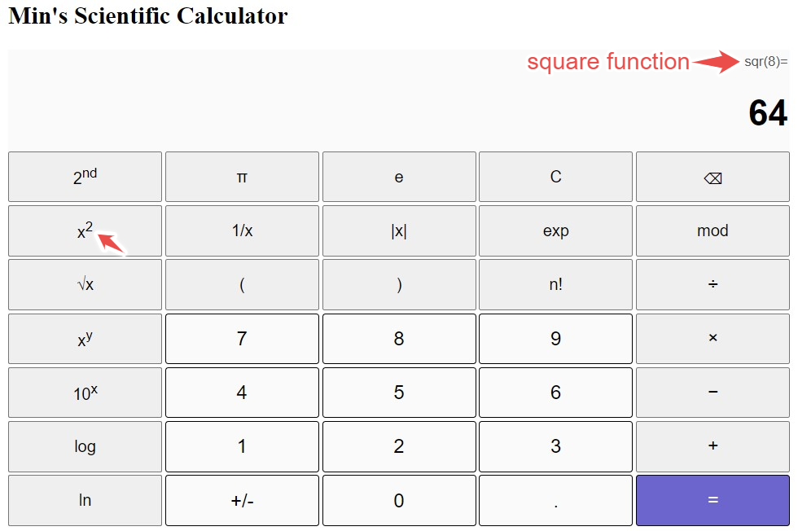
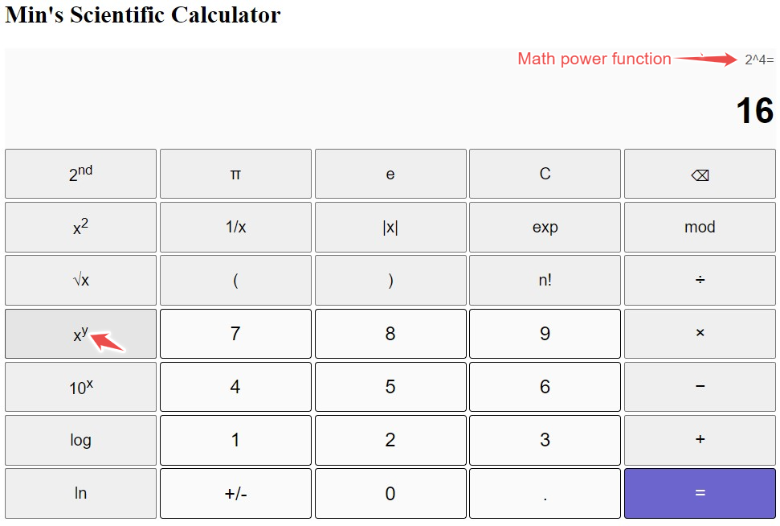
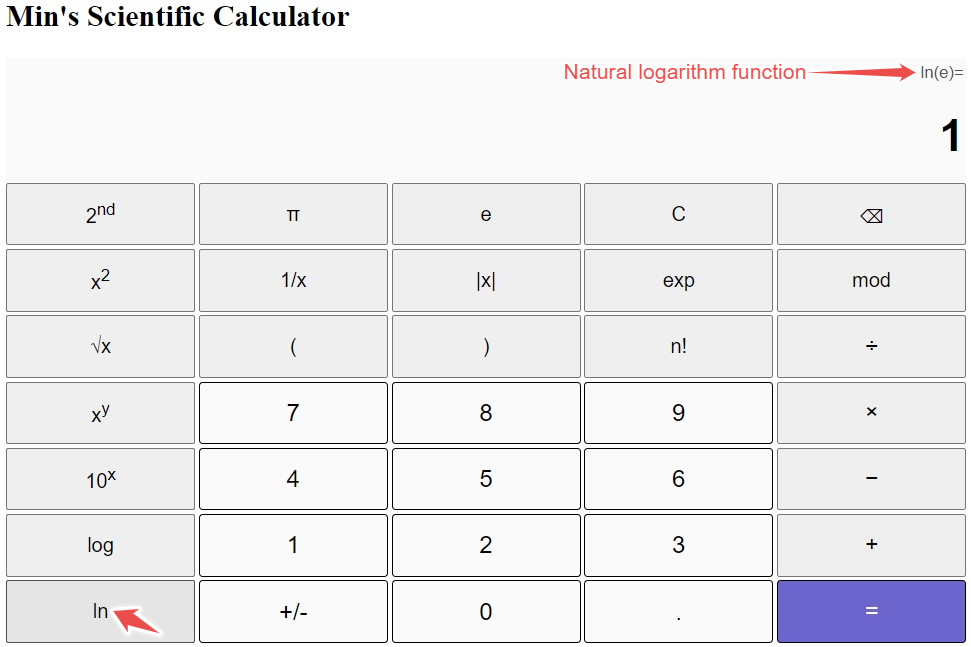
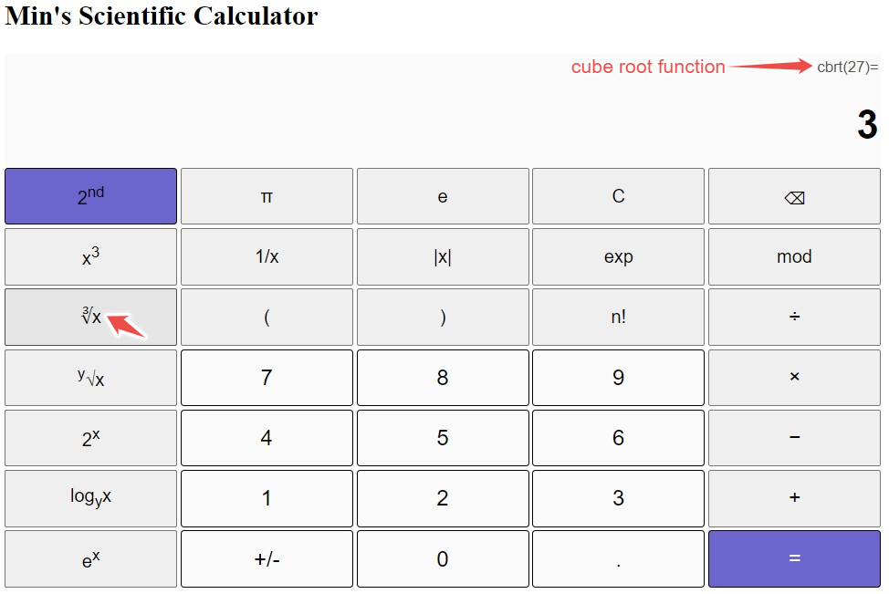
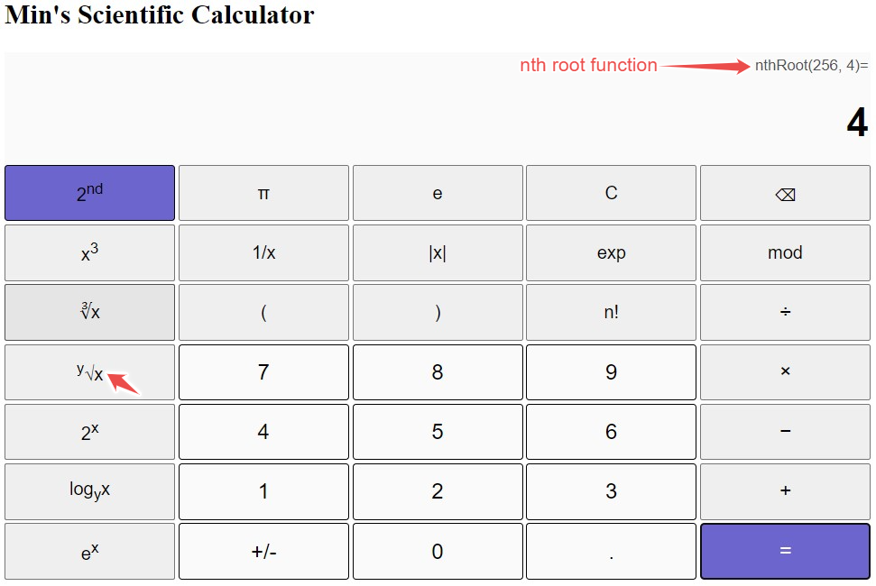
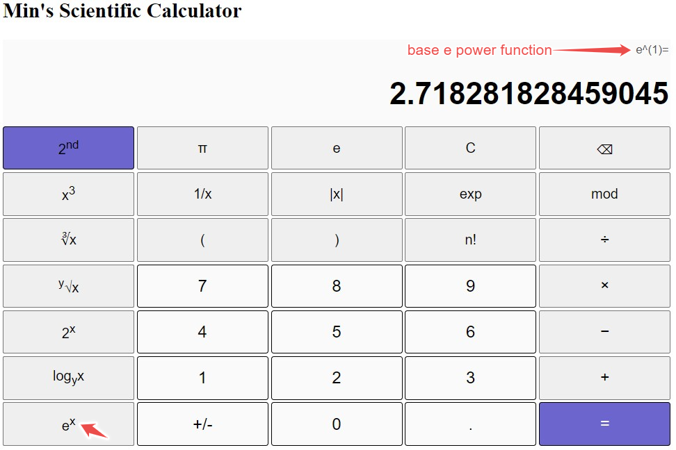

## Introduction
Welcome to my scientific calculator built with complete front-end JavaScript. The GUI appearance and layout references to the Windows 10 scientific calculator.
The operation and functionality also resembles the Windows 10 calculator. Clicking button "=" is handled with JS built-in eval() function. Other functioning buttons are either bound to built-in Math functions or self-defined functions.

## Demos at different situations
### Demo when 2ndFunc toggled OFF

### Demo when 2ndFunc toggoled ON

### Demo of square function (2nd Func off)

### Demo of power function (2nd Func off)

### Demo of natural logarithm (ln) function (2nd Func off)

### Demo of cube root function (2nd Func ON)

### Demo of nth root function (2nd Func ON)

### Demo of base e power (2nd Func ON)

